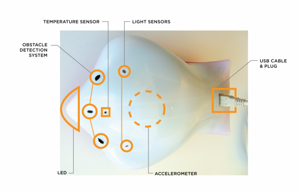

###############################
Introduction to the Finch robot
###############################

This page describes the Finch robot hardware, at a high level.  At the end 
of this lesson, you should be able to answer questions about the capabilities 
of the Finch robot.

   Finch robot hardware diagram, with sensors labeled.  Taken from the `official hardware description`_

.. _finch-sensors-description:

===================
The Finch's sensors
===================

The Finch has the following sensors:

Light
	The Finch has two sensors which can measure light levels.  There is one on
	the right and one on the left.

Temperature
	The Finch has one temperature sensor.  This can tell you the temperature of
	the room.

Obstacle
	The finch has two obstacle sensors in the front.  There is one on the left,
	and one on the right.  They do not tell you the distance to an obstacle, but
	they do tell you if there is an obstacle in front of them.  They work best against
	light-colored or reflective objects.

	These work by sending out infrared light (light we can't see with our eyes) and
	looking for it to bounce back and hit the sensors.

Accelerometers
	The Finch has an accelerometer that can tell you the orientation of the Finch.  That
	means it can tell you whether the Finch is upside down, or tilted in any direction.
	This sensor can also tell you if the Finch is shaken or tapped.

.. _finch-actuators-description:

=====================
The Finch's actuators
=====================

The Finch has the following actuators (things that do actions):

Motors
	The Finch has two motors, one for each wheel.  The Finch's movement direction can be
	controlled by giving the motors different speeds.

Light
	The Finch has a Light-Emitting Diode (LED) in its nose.  It can light up in any color
	by mixing the three colors, red, green, and blue (RGB).

Buzzer
	The finch has a buzzer which can play frequencies between 100 Hz and 10,000 Hz (10 KHz).
	100Hz is a low sound, and 10,000 Hz is a high-pitched sound.

======================
The Finch's connection
======================

The Finch connects to your computer with a USB cable, and it must remain connected in order for
you to control it.  You might find that it helps your Finch move more freely if you hold the cord
above it while it moves.

========================
Check your understanding
========================

Answer the following questions to check that you understand the Finch robot's hardware:

* Can you point to and name each of the sensors on your robot?
* What is an LED?
* Can the Finch's buzzer play a 50 Hz sound?
* How would you use the Finch's motors to make the Finch turn right?  Left?
* Would the Finch's obstacle sensors be more likely to see a black object or a white object?
* How could you tell if the Finch ran into something behind it?

====================
Additional resources
====================

This page is geared towards a younger audience.  For a more detailed description of
the Finch robot's hardware, see the `official hardware description`_

.. _official hardware description: http://www.finchrobot.com/finch-hardware