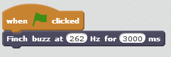
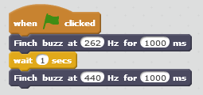

**********************
Controlling the Buzzer
**********************

==============================
Making a sound with the buzzer
==============================

The Finch has a small speaker which we will call a buzzer (see :ref:`finch-actuators-description`
for more information).  In this lesson, we will learn how to make that buzzer play notes of
different frequencies.

The first step is to drag an event from the "Events" block group into the script area.  This
event will tell Scratch when to start our program.  For now, we will use the event that is
triggered when the green flag icon is clicked.

.. image:: ../../../images/when_flag_clicked.png
   :alt: Scratch script with single event

Now we can connect blocks to the bottom of the "When <Flag> clicked" block, and those blocks
will be run whenever we click the green flag.

The block that controls the Finch buzzer says "Finch buzz at 440 Hz for 500 ms".  Drag this
block into your script and connect it to the bottom of the event block.

The first value in the "Finch buzz" block is the frequency (pitch) that the buzzer will play.  It
is measured in units of Hertz (Hz).  A higher value for the frequency will make a higher pitched
sound.  The Finch can play frequencies from 100 Hz to 10,000 Hz (10 KHz).

The second value in the "Finch buzz" block tells the Finch how long to play the note.  It is
measured in units of milliseconds (ms).  A millisecond is one thousandth of a second, or 0.001
seconds.  1000 ms is equal to 1 second.

In the "Finch buzz" block, set the frequency to 262 Hz, and set the duration to 3000 ms.  Then
click the green flag, and you should hear your Finch play a note for 3 seconds.  This note is
called a middle C, which is the C note in the middle of a piano.

Play around with the values in the "Finch buzz" block and click the green flag to see how the
Finch's behavior changes.

================
Playing a melody
================

Now lets play a simple two-note melody.  You might think you can do this by just dragging another
"Finch buzz" block and connecting it to the bottom of the other "Finch buzz" block.  However, the
"Finch buzz" block does not wait while it plays the note.  Instead, it just starts the note and goes
on to the next block.  This means that if you connect two "Finch buzz" blocks without a "Wait" in
between, you will only be able to hear the Finch play the second note.  You can try this to see for
yourself!

To allow the Finch to play one note after another, we must use a "Wait" block which can be found under
the "Control" category.  Drag a "Wait" block into your script and attach it to the bottom of the
"Finch buzz" block.  Set the duration of the "Finch Buzz" block to 1000 ms, and then set the "Wait"
block to wait for 1 second (remember, 1000 ms = 1 second).  Then drag another "Finch buzz" block
and attach it to the bottom of the "Wait" block.  Set the frequency of the two blocks to different
values.  Then click the green flag to run your program.  You should hear two separate notes.

---------
Challenge
---------

Can you write a Scratch program that will make your Finch play the C major scale?  The notes of the
C major scale are listed below.

* C (262 Hz)
* D (294 Hz)
* E (330 Hz)
* F (349 Hz)
* G (392 Hz)
* A (440 Hz)
* B (494 Hz)
* C (523 Hz)

---------
Challenge
---------

Can you create two scratch variables called "duration_sec" and "duration_ms" and use those instead
of numbers as the durations for your "Finch buzz" and "Wait" blocks.  Then can you change the speed
at which your finch plays the notes by changing a single value?

Hints: 

* To create a variable, click "Make a Variable" under the "Data" block category.  Then you can drag
  those variable values into the "Finch buzz" and "Wait" blocks.
* Remember that 1 second is equal to 1000 ms, so to convert from seconds to milliseconds, you
  can set "duration_ms" to "duration_secs" * 1000.  You can find a multiplication block under 
  the "Operators" category because multiplication is an operation.