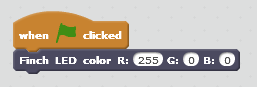
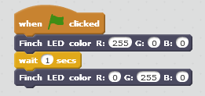
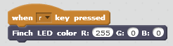

*******************
Controlling the LED
*******************

=======================
Light up a single color
=======================

The Finch has a Light Emitting Diode (LED) in its nose (see :ref:`finch-actuators-description`
for more information).  In this lesson, we will learn how to light up the Finch LED in any color
we like!

The first step is to drag an event from the "Events" block group into the script area.  This
event will tell Scratch when to start our program.  For now, we will use the event that is
triggered when the green flag icon is clicked.

Now we can connect blocks to the bottom of the "When <Flag> clicked" block, and those blocks
will be run whenever we click the green flag.

The block that controls the Finch LED says "Finch LED color R: 0 G: 0 B: 0".  Drag this block
into your script and connect it to the bottom of the event block.

The three values in this block are the red (R), green (G), and blue (B) values of the color.
A larger value for the color means more of that color will be lit up.  The values can be anywhere
from 0 to 255.  Set the colors to "R: 255  G: 0  B: 0".  The LED should light up bright red when
you click the flag icon.

---------
Challenge
---------

Try to set the Finch color to the following colors: green, blue, purple, yellow.  

Hint: you will need to mix the colors to get the colors purple and yelllow.  Ask 
a mentor if you need help.

=============================
Light up two different colors
=============================

Now let's use a "Wait" block to make the light change color after 1 second.  The "Wait" block
can be found under the "Control" blocks.  Drag the "Wait" block into your script, and connect
it to the bottom of the "Finch LED" block.  Then drag another "Finch LED block" into your script
and connect it to the bottom of the "Wait" block.

In the above example, when you click the green flag, the program Finch will light up Red for one
second, and then the color will change to green, and it will stay that way.

---------
Challenge
---------

Can you make the Finch go through a pattern of colors and repeat forever?

Hint: You will need to use a "Forever" loop block from the "Control" blocks.  Ask a mentor if you
need help.

================================
Control colors with the keyboard
================================

There are other event blocks besides the "When <flag> clicked" block that we used in the previous
scripts.  Under "Events", find the block which says "When [space] key pressed", and drag that block
into your script.  If you click on the down arrow next to the word "space", you can select any of 
the space key, or any of the letter, number, or arrow keys on your keyboard.  Set the key to "r".
Then drag a "Finch LED" block and attach it to the bottom or the "When [r] key pressed" block.

To allow Scratch to listen to your key presses, click on any blank space in your script window.  Now
press "r".  Your Finch should light up red.

---------
Challenge
---------

Can you write a Scratch program that will make your Finch light up red when you press the "r" key,
green when you press the "g" key, and blue when you press the "b" key?  Can you also make the Finch
turn off its LED when you press the "space" key?

Hint:  You will need to add three more "When [key] pressed" blocks, select the correct keys
for each block, and connect a "Finch LED" block to each one.  Ask a mentor if you need help.

===============
Other Resources
===============

You can find RGB values for colors on various web pages.  Try 
`this page <http://www.rapidtables.com/web/color/RGB_Color.htm>`_ for example.  
That page has a color picker that allows you to pick a color and then view its
red, green, and blue values.