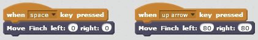
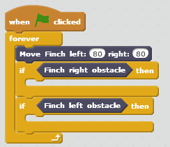
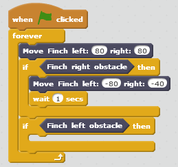

**********************
Controlling the Wheels
**********************

=============================
Making the Finch move forward
=============================

The Finch has two wheels which can be controlled independently (see :ref:`finch-actuators-description`
for more information).  In this lesson we will learn how to control the Finch's wheels to make
it move in the directions we want.

Instead of using the "When <flag> clicked" event block to start our program, we will use
the "When [space] key pressed" block from the "Events" category.  Drag that block into your
script.

The block to control the Finch's wheels is called "Move Finch left: 0 right: 0".  The *left* value
controls the speed of the left wheel, and the *right* value controls the speed of the right wheel.
Use values of at least 20 for the speeds.  Drag the "Move Finch" block into your script and connect
it to the bottom of the "When [space] key pressed" block.  Click in some empty space in your script,
and then press the space bar.  Does anything happen?

Nothing should happen yet because the wheel speeds are set to 0.  Let's keep the speeds set to zero
when we press the space bar, so that we have an easy way to stop the Finch once it's going.

Drag another "When [space] key pressed" block into the script, and change the key from "space" to
"up".  This event will be activated when you press the up arrow key.  Drag a "Move Finch" block and
connect it to the bottom of the "When [up] key pressed" block.  Set *left* and *right* to 80.

Now click anywhere in your script.  You should now be able to press the up arrow key to make the Finch
move forward, and you should be able to press the space bar to stop it.

---------
Challenge
---------

Can you add three more events to your script so that the Finch moves backward when the down
arrow key is pressed, left when the left arrow key is pressed, and right when the right arrow
key is pressed?

Hints:

* You will need to add more "When [  ] key pressed" blocks to your script.
* To make the Finch turn, try setting *left* and *right* to different values to make one
  wheel move faster than the other.
* What happens if you use a negative number (for example, -100) for *left* and *right*?

---------
Challenge
---------

Can you figure out the maximum value for the wheel speeds?  How did you figure it out?

Hint: what makes the Finch turn?

---------
Challenge
---------

Can you add the ability to change the Finch's speed with other keys on the keyboard?
For example, make the "F" key increase the speed, and make the "D" key decrease the 
speed.

Hint:

* Use a variable to store the Finch's current speed.  Select "Make a Variable" under the
  "Data" category to create a variable.
* Use "When [ ] key pressed" blocks to add to and subtract from the speed variable.  You can
  find addition and subtraction blocks under the "Operators" category.
* Use another variable to store the Finch's direction.
* Use a "When <flag> clicked" block to start a forever loop that sets the Finch's wheel
  speeds according to the values of the speed and direction variables.

==============================
Avoiding obstacles when moving
==============================

Next we will write a program to make the Finch wander around and avoid obstacles.  This will
require using the obstacle sensors.  If you are unfamiliar with this, see :ref:`reading-obstacle-sensors`.

First, let's add a "When <flag> clicked" block to our script.  Then drag a "forever" loop block
from the "Control" category and connect it to the bottom of the "When <flag> clicked" block.

.. image:: /scratch/images/when_flag_forever.png
   :alt: Scratch program to loop forever when flag clicked

Now let's think about what we want our program to do.  Sometimes it can be helpful to write
down what you want your program to do using plain English.  This can be referred to as 
pseudocode (fake code).  Let's try it.  Here's what we want our Finch robot to do written as
a set of steps:

#. Move forward

#. If there is an obstacle on my right, ...

	* then back up and turn left a little
	* continue moving forward

#. If there is an obstacle on my left, ...

	* then back up and turn right a little
	* continue moving forward

#. If there is no obstacle, ...

	* then just continue moving forward.

Given this pseudocode, it is fairly simple to write our Scratch program.  First, insert a 
"Move finch" block into the "forever" loop, and set its *right* and *left* values to 80.

Then, insert an "if <> then" block from the "Control" category.  For the condition
after the "if", we want to check whether there is an obstacle in front of the right sensor.
From the "More Blocks" category, drag the "Finch right obstacle" block into the space after
the "if".

Now let's also add a second "if <> then" block under the first "if <> then" block.  The condition
for this one should be whether there is an obstacle in front of the left sensor.  From the "More Blocks" 
category, drag the "Finch left obstacle" block into the space after this second "if".

This is what your program should look like now.

If there is an obstacle in front of the right sensor, we want to tell the Finch to back up and
turn left for a short time.  Drag a "Move Finch" block into the space under the first "if".  
Set *left* to -80 and *right* to -40.  Then drag a "Wait" block from the "Control" category and
connect it to the bottom of the "Move Finch" block.  Set it to wait for 1 second.

This is what your program should look like now.

Now, drag the correct blocks into the space under the second "if" to make the Finch back up and
turn right for a short time if it detects an obstacle on the left.

---------
Challenge
---------

Can you make the obstacle avoidance better by changing some of the speed or wait values?
Try setting up walls of boxes on the floor, and see how well the Finch avoids the walls.