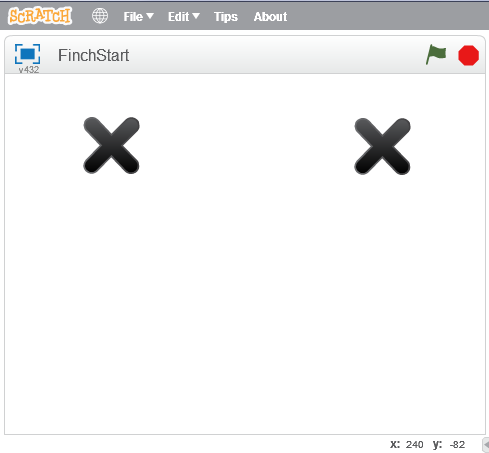
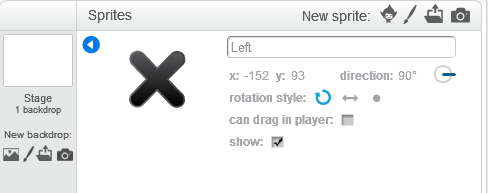
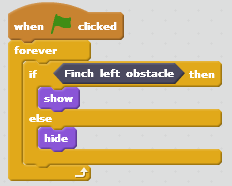

*****************
Sensing Obstacles
*****************

==============================
Reading obstacle sensor values
==============================

The Finch has a left and a right obstacle sensor (see :ref:`finch-sensors-description`
for more information).  In this lesson, we will learn how to read the values of each
obstacle sensor and to use those value to affect the Finch's behavior.

There are two blocks that read the Finch obstacle sensor values, one for the left sensor, and
one for the right sensor.  They are called "Finch left obstacle" and "Finch right obstacle".  
These blocks have Boolean values, meaning they are either *True* or *False*.  This means they
can be used in conditional statement blocks, such as the "if < > then" block.

We will use sprites in Scratch to show the sensor values.  Sprite is just a name for a two-dimensional
image that can be drawn on the screen.  Remove the main cat sprite from your window by right-clicking 
on it and selecting "delete".  Then click the sprite icon next to "New sprite" and select the "X" sprite.
Add a second "X" sprite.  Your screen should look like the screen shown below:

You should rename your sprites by right-clicking on them and selecting "Info".  Enter "Left" for the
name of the left sprite, and enter "Right" for the name of the right sprite.  This is just so we don't
get confused.

Now we want to write a Scratch program to make the left sprite appear when there is an
obstacle in front of the Finch's left sensor and to make the right sprite appear when
there is an obstacle in front of the Finch's right sensor.  We will cover how this is
done for the left sensor, and then it will be up to you to figure out how to make this
work for the right sensor.

First, click on the right sprite.  This will bring up the script for this sprite on the
right side of your screen.  Start as we usually do by dragging the "When <Flag> clicked"
block into the script area.

.. image:: /scratch/images/when_flag_clicked.png
   :alt: Scratch script with single event

Next, find the "forever" loop block from the "Control" category.  Drag this into your script
and connect it to the bottom of the "When <flag> clicked" block.  This block will loop
forever, running the blocks inside of it repeatedly until you stop the program.

Each time our loop runs, we want to check whether the left obstacle sensor sees an obstacle.
If it does, we want to show the "Left" sprite.  Otherwise, we want to hide the "Left" sprite.
We will use an if-then-else block to do the check on the obstacle sensor value.

Find the "if <> then [] else" block from the "Control" category.  Drag it inside the "forever"
loop block in your script.  Next, find the "Finch left obstacle" block under the "More Blocks"
category.  Drag this into the space after the "if".  The "Finch left obstacle" block has the
value "True" when it senses and obstacle and "False" when it doesn't.

Next find the "show" and "hide" blocks from the "Looks" category.  Drag the "show" into the
space under the "if".   Drag the "hide" into the space under the "else".  Your script for the
"Left" sprite should now look like this.

Click the green flag, and try putting your hand in front of the left obstacle sensor.  Note
that if you get too close, it won't sense the obstacle.  When your hand is in front of the
obstacle, the left sprite should appear on the screen.

---------
Challenge
---------

Write a script for the right obstacle so that the right sprite will show up only when
there is an obstacle in front of the right sensor.  Hints:

* Click on the "Right" sprite to open the script for that sprite.
* Use the "Finch right obstacle" block.

Ask a mentor if you need help.

---------
Challenge
---------

Can you write a Scratch program so that the LED lights up different colors depending on
whether the Finch sees an obstacle on the right or left?