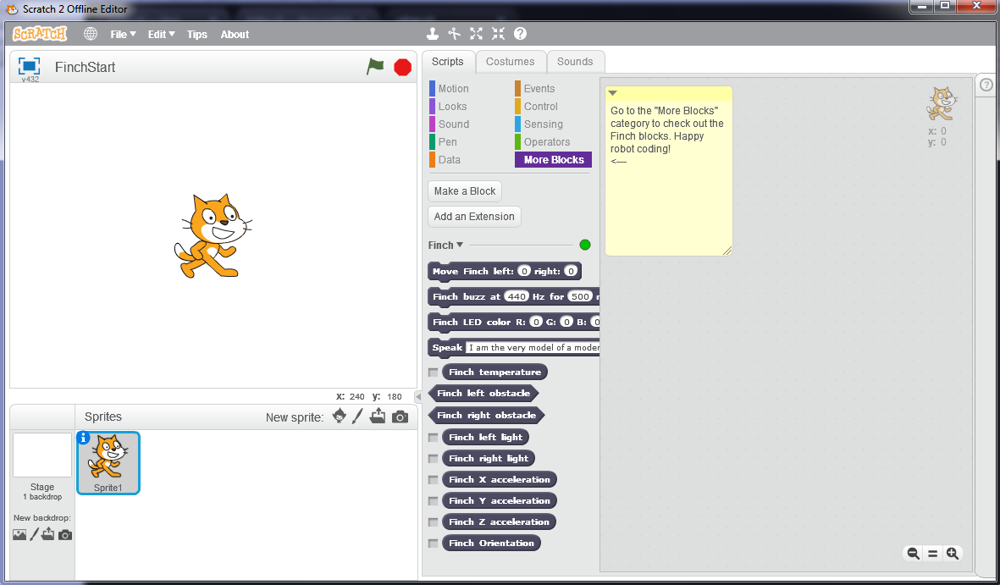
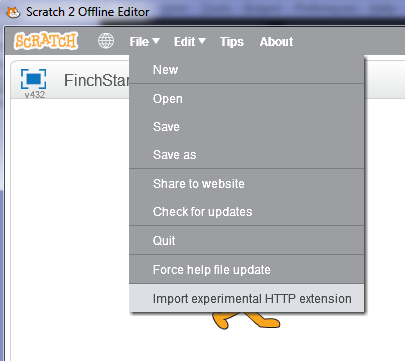
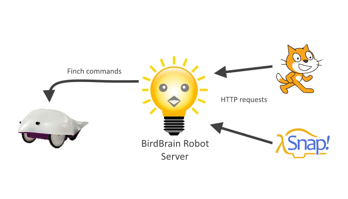

*****************************
Setting up Finch with Scratch
*****************************

This page will describe how to set up your computer to program the Finch
robot with Scratch.

==============================
Install Scratch Offline Editor
==============================

You will need to install the Scratch 2 Offline editor, which can be downloaded
from the `official Scratch downloads page <http://scratch.mit.edu/scratch2download/>`_

==============================
Install BirdBrain Robot Server
==============================

You will also need to install the BirdBrain Robot server.  Here are the instructions
for Windows and Mac:

Windows
	Download and run the `BirdBrain Robot Server installer for Windows`_.

Mac OSX
	Download the `BirdBrain Robot Server application for Mac`_, and drag the app icon
	into your Applications folder.  Then, if runnning Mac OSX 10.9 or later, open your
	Applications folder in Finder, command-click on the BirdBrainRobot Server, click
	"Get Info", and then check the box to disable App Nap.

Linux
	See the `official Finch scratch installation instructions`_.

===========================
Start BirdBrain and Scratch
===========================

Plug in your Finch robot to your computer and launch the BirdBrain Robot Server.  BirdBrain
should show that your Finch robot is connected.  Click to launch scratch from the BirdBrain
Robot Server application.

When Scratch opens, the Finch blocks should be available under the "More Blocks" section of
your Scratch Editor.

   Scratch Offline Editor showing the Finch blocks under 'More Blocks'.

If the Finch blocks are not available under 'More Blocks', make sure that you launched the
Scratch Offline Editor from the button in the BirdBrain Scratch Robot Server application, and
make sure that the Finch robot was connected when you launched Scratch.

If the Finch blocks are still not available, download the `BirdBrain scratch blocks`_ and
unzip it somewhere (e.g. in your 'Documents' or 'My Documents' folder).  Then open the Scratch
Offline Editor.  Hold down 'Shift' and then click 'File' -> 'Import experimental HTTP
extension'.  

Browse to the location of the Finch.s2e file in the folder that you unzipped, and
select it.  The Finch blocks should now be available under 'More Blocks'.

You are now ready to start programming your Finch robot in Scratch!

================================
How BirdBrain Robot Server works
================================

The BirdBrain robot server is only required for programming the Finch robot in Scratch
or Snap.  Its job is to receive requests from Scratch or Snap and send the correct commands
to the Finch Robot over USB.

===============
Other Resources
===============

Please see the `official Finch scratch installation instructions`_ for more details on getting 
your Finch working with Scratch if the above instructions are not sufficient.  You can also find 
instructions for installing on Linux there.

.. _BirdBrain Robot Server installer for Windows: http://dl.dropboxusercontent.com/u/9303915/windows/BirdBrainRobotServerInstaller.msi
.. _BirdBrain Robot Server application for Mac: https://dl.dropboxusercontent.com/u/9303915/Mac/BirdBrainRobotServer16.dmg
.. _BirdBrain scratch blocks: http://www.hummingbirdkit.com/sites/default/files/software/BirdBrainScratch.zip
.. _official Finch scratch installation instructions: http://finchrobot.com/software/scratch